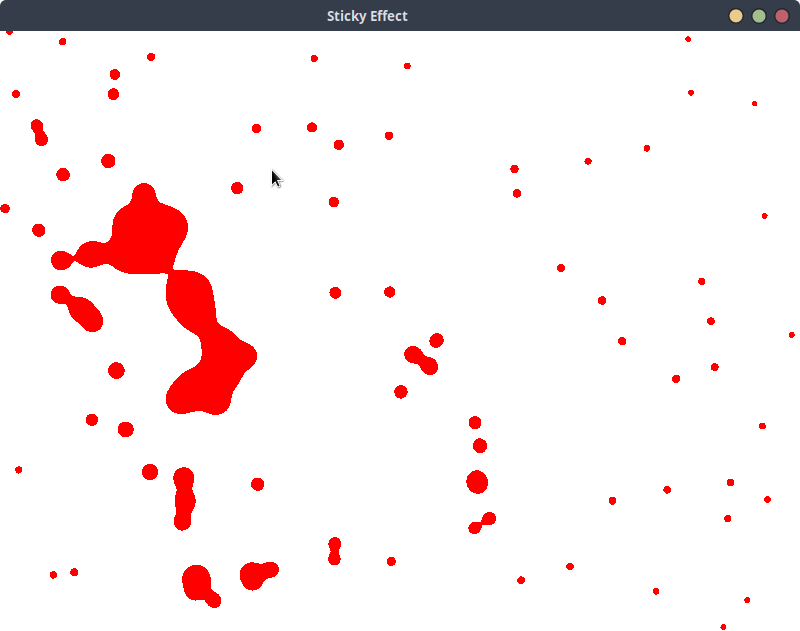
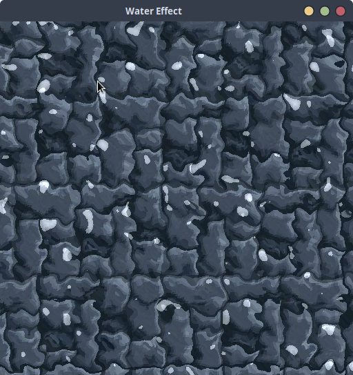
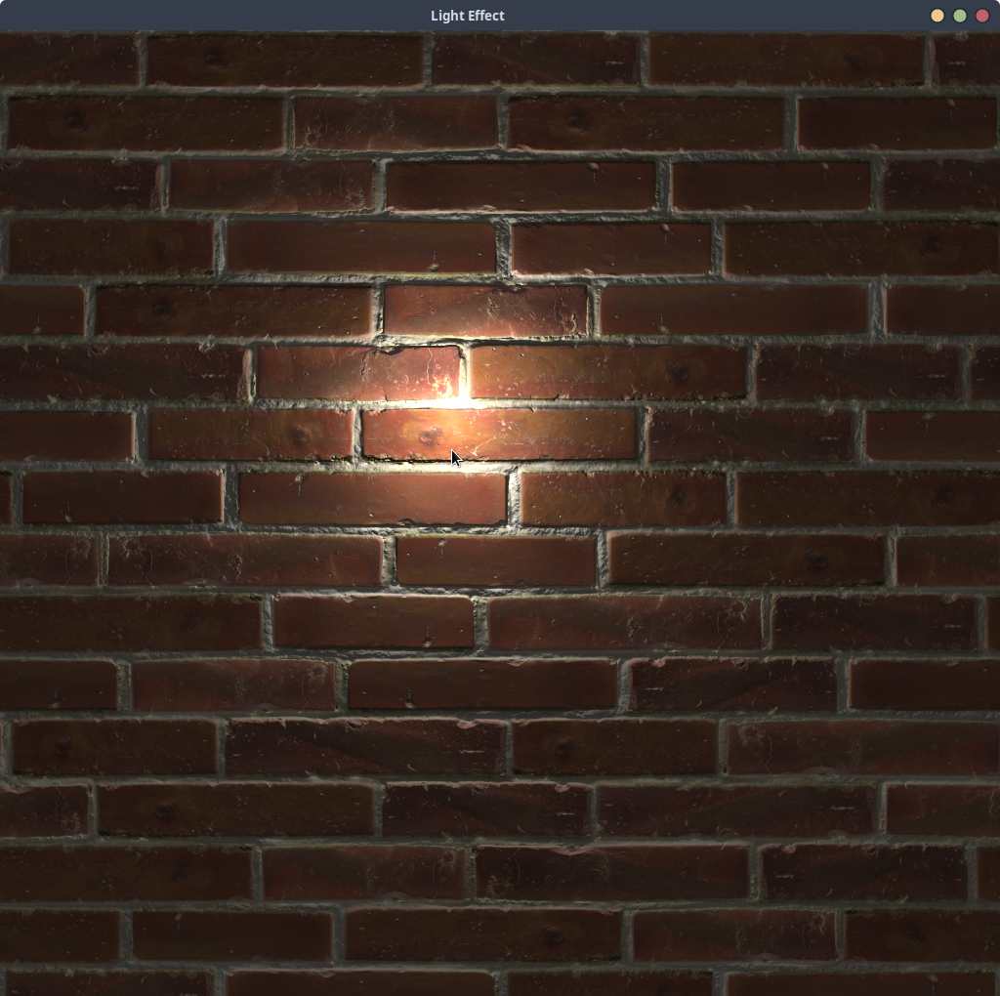

# README 2D_SHADERS
Ce projet contient trois sous-projets principaux: LIGHT, WATER et STICKY

## Installation de SFML

SFML (Simple and Fast Multimedia Library) est une bibliothèque fournissant une interface simple pour les différents composants de votre PC, pour faciliter le développement de jeux et de programmes multimédias.

### Sur Ubuntu

1. Ouvrez un terminal
2. Mettez à jour la liste des paquets disponibles : `sudo apt update`
3. Installez SFML : `sudo apt-get install libsfml-dev`

### Sur Windows avec Visual Studio

1. Téléchargez la SFML depuis le site officiel : https://www.sfml-dev.org/download.php
2. Décompressez l'archive dans un dossier de votre choix
3. Dans Visual Studio, cliquez avec le bouton droit sur votre projet, puis sélectionnez "Propriétés"
4. Allez dans "C/C++" -> "Général" -> "Autres répertoires Include" et ajoutez le chemin vers le dossier "include" de la SFML
5. Allez dans "Éditeur de liens" -> "Général" -> "Autres répertoires de bibliothèques" et ajoutez le chemin vers le dossier "lib" de la SFML
6. Allez dans "Éditeur de liens" -> "Entrée" -> "Dépendances supplémentaires" et ajoutez les bibliothèques de la SFML que vous utilisez (par exemple "sfml-graphics.lib", "sfml-window.lib", "sfml-system.lib")

## Utilisation du projet

1. Clonez le dépôt : `git clone <url_du_dépôt>`
2. Ouvrez le projet dans votre IDE
3. Assurez-vous que la SFML est correctement installé et que votre IDE peut ainsi la trouver
4. Compilez et exécutez le projet

## Présentation du projet

Le projet est divisé en 3 parties, une première approche assez simple avec Sticky, une utilisation des textures en tant que
noises dans Water, et enfin une vision plus poussée du shader avec l'utilisation d'une normal map, créant du réalisme.

### STICKY

Le sous-projet STICKY implémente un shader "collant/effet de groupe" 2D.

### WATER

Le sous-projet WATER implémente un shader d'eau 2D en utilisant la distorsion causée par des textures de bruit

### LIGHT

Le sous-projet LIGHT implémente un shader de lumière 2D via normal map.

